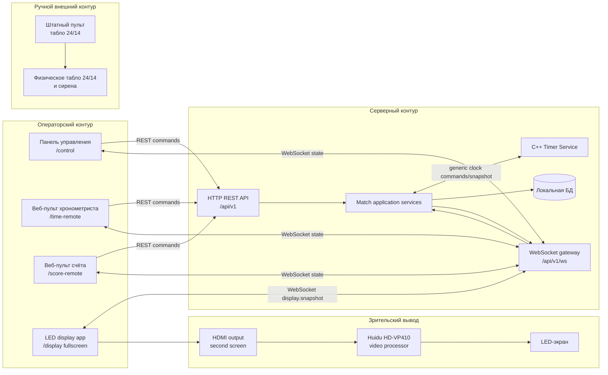
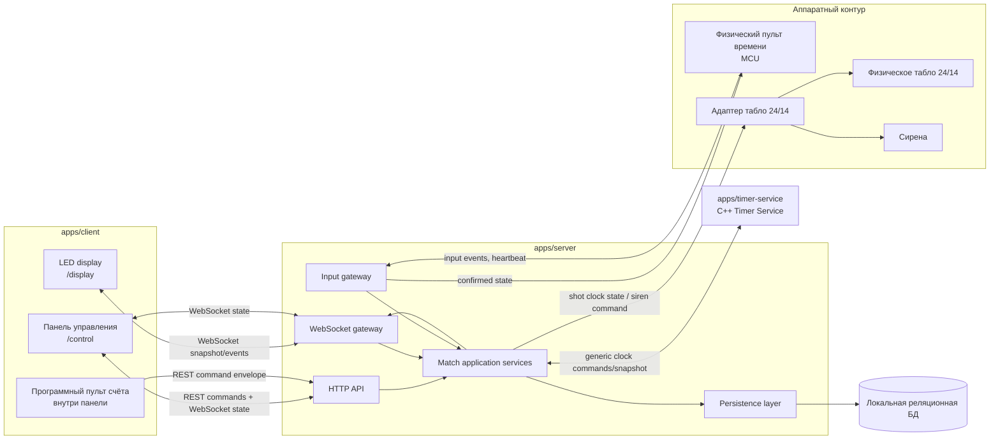
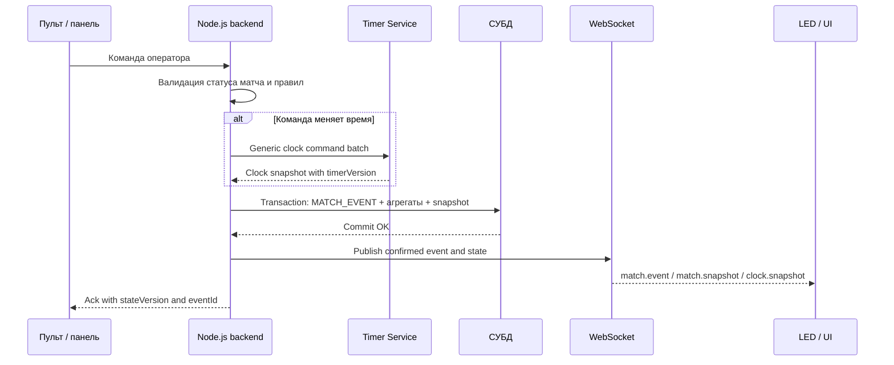
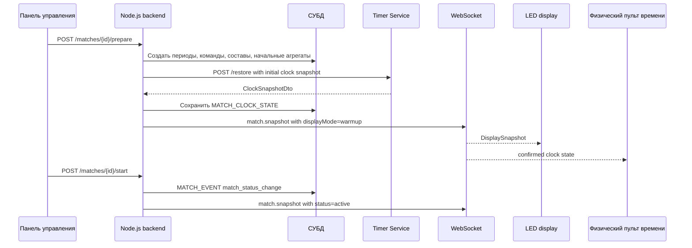
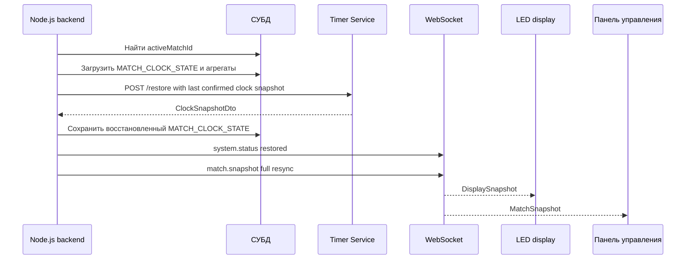

# Схема API и диаграмма взаимодействия компонентов

## Статус

Проектный контракт целевой системы. Документ фиксирует границы компонентов, основные REST/WebSocket-контракты и формат команд между UI, Node.js backend, Timer Service, физическими пультами, сиреной и физическим табло 24/14.

Markdown-документ является архитектурным источником правды. OpenAPI-спецификация и типы в `libs/contracts` должны строиться на основе этого документа после согласования контрактов.

Разделы **Stage 1 / MVP** фиксируют контур реализации первого этапа. Разделы целевой системы описывают совместимые будущие расширения и не должны трактоваться как обязательный объём Stage 1.

## Основания

- `docs/ТЗ_«Электронное_баскетбольное_табло».md`
- `docs/data-model.md`
- `docs/timer-service-architecture.md`
- `libs/contracts/README.md`
- Microsoft Azure REST API Guidelines: <https://github.com/microsoft/api-guidelines/blob/vNext/azure/Guidelines.md>
- Google API Improvement Proposals: <https://google.aip.dev/>
- RFC 9110 HTTP Semantics: <https://www.rfc-editor.org/rfc/rfc9110>
- RFC 9457 Problem Details for HTTP APIs: <https://www.rfc-editor.org/rfc/rfc9457>
- W3C Trace Context: <https://www.w3.org/TR/trace-context/>
- OWASP API Security Top 10 2023: <https://owasp.org/API-Security/editions/2023/en/0x11-t10/>
- OpenAPI Specification 3.1: <https://spec.openapis.org/oas/v3.1.0.html>
- AsyncAPI Specification: <https://www.asyncapi.com/docs/reference/specification/v3.0.0>

## Принципы контрактов

1. Node.js backend является точкой правды бизнес-состояния матча.
2. Timer Service является runtime-точкой правды значений `game_clock` и `shot_clock`, но не знает правил FIBA, периодов, счёта, фолов и тайм-аутов.
3. UI, программные пульты и MCU-пульты не рассчитывают официальный счёт, фолы и время независимо от сервера.
4. Клиенты отображают только подтверждённое состояние, полученное от Node.js backend.
5. Любое подтверждённое игровое изменение или важное служебное изменение записывается в append-only `MATCH_EVENT`, а затем публикуется подписчикам. Периодические clock snapshots, heartbeat и дубли команд не создают `MATCH_EVENT`.
6. Команды времени проходят через Node.js backend: backend валидирует игровое действие и преобразует его в generic-команды Timer Service.
7. Каждый контракт содержит версию состояния или идентификатор события, чтобы клиенты могли обнаруживать пропуски и переподключаться без рассинхронизации.
8. На одной установке активен только один матч. Несколько матчей могут быть в расписании, но live-контур обслуживает один `activeMatchId`.
9. Клиент может локально интерполировать отображение времени между подтверждёнными `clock.snapshot`, но обязан корректироваться по версии Timer Service и не должен считать локальную интерполяцию официальным состоянием.
10. REST является предпочтительным транспортом для команд, если команда не требует постоянного соединения. WebSocket используется для real-time рассылки состояния и может использоваться для ввода только через тот же command envelope.
11. HTTP API использует стандартную семантику методов: `GET` только читает, `POST` запускает команды и действия, `PUT` заменяет целое состояние ресурса, `PATCH` частично изменяет ресурс, `DELETE` удаляет или архивирует ресурс.
12. Команды и операции с побочными эффектами должны быть идемпотентны через `Idempotency-Key` или `clientCommandId`.
13. Списковые endpoint-ы с самого начала должны поддерживать pagination, даже если первые экраны используют короткие списки.
14. Ошибки REST возвращаются в формате `application/problem+json`, совместимом с RFC 9457.
15. Все контракты проектируются как будущие OpenAPI/AsyncAPI схемы: стабильные имена DTO, явные enum-значения, примеры payload и однозначные status codes.

## Stage 1 / MVP scope

Stage 1 реализует программный контур проведения матча без программного управления VP410, без обратной связи от VP410, без MCU-пульта и без программного адаптера физического табло 24/14.

Входит в Stage 1:

- Node.js backend: REST API, WebSocket gateway, бизнес-логика, журнал событий, работа с БД.
- Timer Service: точные runtime-счётчики `game_clock` и `shot_clock`.
- Веб-панель управления и веб-пульты: счёт, фолы, тайм-ауты, владение, game clock, shot clock.
- LED display `/display`: полноэкранное табло на втором экране оператора.
- Вывод на LED: desktop/browser window -> HDMI -> VP410 -> LED-экран.
- Сирена: вручную через штатный проводной пульт физического табло 24/14.
- Восстановление состояния матча из БД и повторная подписка клиентов.

Не входит в Stage 1:

- программное управление VP410;
- получение telemetry/ack от VP410 или LED-экрана;
- автоматическая сирена через Комплекс;
- программное управление физическим табло 24/14;
- физический MCU-пульт;
- реверс-инжиниринг аппаратного протокола как обязательный runtime-контур матча.

## Stage 1 component diagram



Правила Stage 1:

1. Веб-пульты и панель не рассчитывают официальное состояние локально; они отправляют команды и показывают подтверждённый snapshot.
2. `/display` получает состояние через WebSocket и выводит fullscreen-табло. Фактический кадр на LED после VP410 не подтверждается программно.
3. VP410 управляется оператором вручную через собственное меню устройства; API не меняет яркость, контраст, входы и раскладки VP410.
4. Физическое табло 24/14 и сирена не управляются backend-ом. Shot clock дублируется на LED, а сирена подаётся штатным пультом.
5. При отказе LED/VP410 данные матча не теряются; оператор видит состояние в панели, но обязан визуально контролировать зрительский экран.

## Компоненты целевой системы



## Поток подтверждённого изменения состояния



Клиент не должен показывать команду как официальную до получения `ack` или соответствующего WebSocket-события с новой версией.

## Поток старта матча



Матч нельзя стартовать, если не созданы две стороны матча, активный период, начальный `MATCH_CLOCK_STATE`, составы и успешный restore Timer Service.

## Поток восстановления после сбоя



Если Timer Service не восстановился, backend не продолжает live-матч и переводит команды времени в degraded mode.

## Принятые архитектурные решения

| Вопрос | Решение |
| --- | --- |
| Источник бизнес-состояния | Только Node.js backend. |
| Источник live-времени | Timer Service для `game_clock` и `shot_clock`; FIBA-правила остаются в backend. |
| Локальная интерполяция времени | Разрешена для плавного отображения, но не является источником истины. |
| Активный матч | Один активный матч на одном устройстве. |
| Физическое табло 24/14 | Входит в целевой API-контур через адаптер, а не является отдельной независимой системой. |
| Сирена | Может вызываться оператором вручную через API и автоматически backend-ом по правилам FIBA при окончании времени. |
| Пульт счёта | Программный веб-пульт внутри панели управления. |
| Пульт времени | Физический MCU-пульт, который отправляет input events и отображает подтверждённое состояние. |
| Транспорт команд | REST предпочтителен. WebSocket-команды допустимы только через тот же command envelope. |
| Документация контрактов | На текущем этапе источник правды - Markdown. OpenAPI создаётся следующим артефактом на его основе. |

Для Stage 1 эти решения сужаются: пульт времени является веб-пультом, сирена вызывается только штатным физическим пультом вне API, физическое табло 24/14 не управляется backend-ом, а VP410 получает только HDMI-сигнал без программного управления и обратной связи.

## Внедрённые API best practices

| Практика | Как применяется в системе |
| --- | --- |
| Resource-oriented REST | CRUD endpoint-ы строятся вокруг ресурсов: `teams`, `players`, `game-days`, `matches`, `scoreboard-layouts`. |
| Command endpoints for side effects | Игровые действия с побочными эффектами идут через `/commands`, потому что это не CRUD-изменение одного ресурса. |
| Standard HTTP methods | `GET` не меняет состояние; команды используют `POST`; частичное изменение справочников использует `PATCH`; полная фиксация состава использует `PUT`. |
| Idempotency for retries | Любая команда имеет `clientCommandId`; HTTP-запрос дополнительно может передавать `Idempotency-Key`. |
| Optimistic concurrency | Изменения ресурсов принимают `If-Match` с `ETag` или ожидаемый `stateVersion`, чтобы не перетирать новое состояние старым экраном. |
| Problem Details | Ошибки REST возвращаются как `application/problem+json` с доменным `code` в расширении. |
| Pagination from day one | Все списки принимают `pageSize` и `pageToken`, а ответы возвращают `nextPageToken`. |
| Trace context | Все HTTP/WebSocket команды прокидывают `traceparent`, чтобы связать UI, backend, Timer Service и adapter logs. |
| Explicit retry policy | Ответы `429`, `503` и degraded mode используют `Retry-After`, если повтор допустим. |
| Least privilege and object checks | Даже без сложной авторизации MVP backend проверяет, что команда относится к активному матчу, зарегистрированному устройству и допустимому объекту. |
| Machine-readable specs | Markdown остаётся архитектурным источником, но REST переносится в OpenAPI 3.1, а WebSocket-события - в AsyncAPI. |

## Версионирование и общий envelope

### REST request headers

| Header | Назначение |
| --- | --- |
| `Idempotency-Key` | Стандартный ключ идемпотентности для `POST`/`PATCH` команд. Для команд должен совпадать с `clientCommandId` или быть связан с ним в `COMMAND_LOG`. |
| `X-Request-Id` | Человекочитаемая трассировка запроса. Если не передан, backend генерирует свой `requestId`. |
| `X-Client-Id` | Идентификатор UI-клиента, программного пульта или MCU. |
| `X-Api-Version` | Версия публичного API. Начальная версия: `2026-05-24`. |
| `traceparent` | W3C Trace Context для сквозной трассировки между frontend, backend, Timer Service и аппаратным адаптером. |
| `If-Match` | Оптимистическая блокировка при изменении ресурсов или применении команды к ожидаемой версии состояния. |
| `Accept` | Для REST JSON: `application/json`; для ошибок клиент должен принимать `application/problem+json`. |
| `Content-Type` | Для JSON-запросов: `application/json`; для merge patch: `application/merge-patch+json`. |

### REST response headers

| Header | Назначение |
| --- | --- |
| `ETag` | Версия ресурса или snapshot для последующих `If-Match` / `If-None-Match`. |
| `Location` | URL созданного ресурса для `201 Created`. |
| `Retry-After` | Когда клиент может повторить запрос после `429`, `503` или временного degraded mode. |
| `traceparent` | Продолжение или созданный backend trace context. |
| `Cache-Control` | Для live-состояния: `no-store`; для статичных справочников может быть короткий cache TTL. |

### REST success envelope

Resource CRUD может возвращать сам ресурс без дополнительной обёртки, чтобы OpenAPI-клиенты получали простые схемы. Команды возвращают command result envelope, потому что кроме данных команды нужен `stateVersion`, `eventId` и результат идемпотентности.

```json
{
  "requestId": "req_01HY...",
  "apiVersion": "2026-05-24",
  "data": {},
  "stateVersion": 1842
}
```

`stateVersion` является версией бизнес-состояния матча в Node.js backend. Она увеличивается после каждого подтверждённого изменения матча.

### REST problem details

REST-ошибки возвращаются с `Content-Type: application/problem+json`.

```json
{
  "type": "https://scoreboard-fok.local/problems/match-not-active",
  "title": "Match is not active",
  "status": 409,
  "detail": "Матч не находится в активном состоянии",
  "instance": "/api/v1/matches/018f4e3a-2b1c-7c4d-9a10-000000000001/commands",
  "requestId": "req_01HY...",
  "traceId": "00-4bf92f3577b34da6a3ce929d0e0e4736-00f067aa0ba902b7-00",
  "code": "MATCH_NOT_ACTIVE",
  "details": {
    "matchId": "018f4e3a-2b1c-7c4d-9a10-000000000001",
    "matchStatus": "scheduled"
  }
}
```

### Базовые коды ошибок

| Код | Когда возвращается |
| --- | --- |
| `VALIDATION_ERROR` | Неверный формат запроса или отсутствуют обязательные поля. |
| `NOT_FOUND` | Сущность не найдена. |
| `CONFLICT` | Команда конфликтует с текущей версией состояния. |
| `MATCH_NOT_ACTIVE` | Команда допустима только для активного матча. |
| `PERIOD_NOT_ACTIVE` | Нет активного периода для команды. |
| `CLOCK_SERVICE_UNAVAILABLE` | Timer Service недоступен или не восстановлен. |
| `CLOCK_COMMAND_REJECTED` | Timer Service отклонил batch generic-команд. |
| `FIBA_RULE_VIOLATION` | Команда нарушает доменное ограничение. |
| `IDEMPOTENCY_REPLAY` | Повтор уже применённой команды. |
| `DEVICE_NOT_LINKED` | Команда пришла от незарегистрированного пульта. |

### HTTP status codes

| Status | Когда используется |
| --- | --- |
| `200 OK` | Успешный `GET`, `PATCH`, command action или синхронная операция. |
| `201 Created` | Создан новый ресурс; ответ содержит `Location`. |
| `204 No Content` | Удаление или архивирование выполнено, тело ответа не нужно. |
| `400 Bad Request` | Неверный JSON, query parameter, header или общий формат запроса. |
| `401 Unauthorized` | Клиент не прошёл будущую авторизацию, если она будет включена. |
| `403 Forbidden` | Клиент известен, но не имеет права на действие или устройство. |
| `404 Not Found` | Ресурс не найден или его существование нельзя раскрывать клиенту. |
| `409 Conflict` | Конфликт `stateVersion`, `ETag`, статуса матча или повтор `Idempotency-Key` с другим body. |
| `422 Unprocessable Content` | Формат валиден, но доменное правило запрещает команду. |
| `429 Too Many Requests` | Клиент или устройство превысило лимит команд; желательно вернуть `Retry-After`. |
| `503 Service Unavailable` | Timer Service, БД или аппаратный адаптер временно недоступны; желательно вернуть `Retry-After`. |

### Pagination

Все списковые endpoint-ы принимают одинаковые query-параметры:

| Parameter | Назначение |
| --- | --- |
| `pageSize` | Желаемый размер страницы. Сервер может вернуть меньше. Значение выше максимума уменьшается до максимума. |
| `pageToken` | Непрозрачный токен следующей страницы. Клиент не должен разбирать его структуру. |
| `filter` | Ограниченный строковый фильтр, если endpoint явно его поддерживает. |
| `orderBy` | Ограниченный список сортировок, если endpoint явно его поддерживает. |

Пример ответа списка:

```json
{
  "items": [],
  "nextPageToken": "eyJvZmZzZXQiOjUwLCJzaWciOiIuLi4ifQ"
}
```

`pageToken` должен быть связан с исходными фильтрами. Если клиент меняет `filter` или `orderBy` при использовании старого token, backend возвращает `400 Bad Request`.

## REST API

REST используется для CRUD, явных команд оператора, команд программного пульта счёта, восстановления начального состояния и ручного управления сиреной. Real-time обновления идут через WebSocket.

### Stage 1 REST API surface

Stage 1 должен реализовать следующий публичный REST-контур. Остальные endpoint-ы из целевого раздела допустимы только если они не расширяют runtime-обязательства MVP.

| Группа | Метод | Путь | Stage 1 назначение |
| --- | --- | --- | --- |
| Health | `GET` | `/api/v1/healthz` | Готовность API. |
| Health | `GET` | `/api/v1/system/status` | API, БД, Timer Service, WebSocket clients, логический статус display. |
| Reference | `GET` | `/api/v1/teams` | Список команд. |
| Reference | `POST` | `/api/v1/teams` | Создать команду. |
| Reference | `PATCH` | `/api/v1/teams/{teamId}` | Изменить команду. |
| Reference | `GET` | `/api/v1/players` | Список игроков. |
| Reference | `POST` | `/api/v1/players` | Создать игрока. |
| Reference | `PATCH` | `/api/v1/players/{playerId}` | Изменить игрока. |
| Layout | `GET` | `/api/v1/scoreboard-layouts` | Список профилей LED-табло. |
| Layout | `POST` | `/api/v1/scoreboard-layouts` | Создать профиль LED-табло. |
| Layout | `PATCH` | `/api/v1/scoreboard-layouts/{layoutId}` | Изменить профиль LED-табло. |
| Game day | `GET` | `/api/v1/game-days` | Список игровых дней. |
| Game day | `POST` | `/api/v1/game-days` | Создать игровой день. |
| Match | `GET` | `/api/v1/matches` | Список матчей. |
| Match | `POST` | `/api/v1/matches` | Создать матч. |
| Match | `PATCH` | `/api/v1/matches/{matchId}` | Изменить расписание, площадку, профиль табло. |
| Match | `PUT` | `/api/v1/matches/{matchId}/roster` | Зафиксировать составы матча. |
| Match | `POST` | `/api/v1/matches/{matchId}/prepare` | Подготовить матч к запуску и восстановить Timer Service. |
| Match | `POST` | `/api/v1/matches/{matchId}/start` | Начать live-матч. |
| Match | `POST` | `/api/v1/matches/{matchId}/finish` | Завершить матч. |
| Snapshot | `GET` | `/api/v1/matches/{matchId}/snapshot` | Полный snapshot для панели и веб-пультов. |
| Snapshot | `GET` | `/api/v1/matches/{matchId}/display-snapshot` | Облегчённый snapshot для `/display`. |
| Events | `GET` | `/api/v1/matches/{matchId}/events` | Журнал подтверждённых событий. |
| Commands | `POST` | `/api/v1/matches/{matchId}/commands` | Канонический command envelope. |
| Commands | `POST` | `/api/v1/matches/{matchId}/commands/score` | Очки. |
| Commands | `POST` | `/api/v1/matches/{matchId}/commands/score-correction` | Коррекция счёта. |
| Commands | `POST` | `/api/v1/matches/{matchId}/commands/foul` | Фолы. |
| Commands | `POST` | `/api/v1/matches/{matchId}/commands/timeout` | Тайм-ауты. |
| Commands | `POST` | `/api/v1/matches/{matchId}/commands/possession` | Владение. |
| Commands | `POST` | `/api/v1/matches/{matchId}/commands/display-mode` | Режим `/display`. |
| Commands | `POST` | `/api/v1/matches/{matchId}/commands/clock/start` | Запуск game/shot clock. |
| Commands | `POST` | `/api/v1/matches/{matchId}/commands/clock/stop` | Остановка game/shot clock. |
| Commands | `POST` | `/api/v1/matches/{matchId}/commands/clock/set` | Установка времени. |
| Commands | `POST` | `/api/v1/matches/{matchId}/commands/clock/adjust` | Коррекция времени. |
| Commands | `POST` | `/api/v1/matches/{matchId}/commands/shot-clock/reset` | Сброс shot clock на 24/14. |
| Commands | `POST` | `/api/v1/matches/{matchId}/commands/clock/game-action` | Одно игровое действие веб-пульта хронометриста. |
| Commands | `POST` | `/api/v1/matches/{matchId}/commands/clock/emergency-stop` | Аварийный стоп часов. |
| Commands | `POST` | `/api/v1/matches/{matchId}/commands/period/start` | Начать период. |
| Commands | `POST` | `/api/v1/matches/{matchId}/commands/period/end` | Завершить период. |

Stage 1 не реализует публичные REST endpoint-ы управления VP410, физическим табло 24/14, аппаратным MCU-пультом или автоматической сиреной.

### Health

| Метод | Путь | Назначение |
| --- | --- | --- |
| `GET` | `/api/v1/healthz` | Проверка готовности API-сервера. |
| `GET` | `/api/v1/system/status` | Статус API, БД, Timer Service и подключённых клиентов. |

Пример `GET /api/v1/system/status`:

```json
{
  "requestId": "req_01HY...",
  "apiVersion": "2026-05-24",
  "data": {
    "api": "ready",
    "database": "ready",
    "timerService": "ready",
    "activeMatchId": "018f4e3a-2b1c-7c4d-9a10-000000000001",
    "connectedClients": [
      {
        "clientId": "display-main",
        "clientType": "display",
        "status": "online",
        "lastSeenAt": "2026-05-24T13:20:01.000Z"
      }
    ]
  },
  "stateVersion": 1842
}
```

### Справочники

| Метод | Путь | Назначение |
| --- | --- | --- |
| `GET` | `/api/v1/teams` | Список команд. |
| `POST` | `/api/v1/teams` | Создать команду. |
| `GET` | `/api/v1/teams/{teamId}` | Карточка команды. |
| `PATCH` | `/api/v1/teams/{teamId}` | Изменить команду. |
| `GET` | `/api/v1/players` | Список игроков. |
| `POST` | `/api/v1/players` | Создать игрока. |
| `GET` | `/api/v1/players/{playerId}` | Карточка игрока. |
| `PATCH` | `/api/v1/players/{playerId}` | Изменить игрока. |
| `GET` | `/api/v1/venues` | Список площадок. |
| `POST` | `/api/v1/venues` | Создать площадку. |
| `GET` | `/api/v1/scoreboard-layouts` | Список профилей табло. |
| `POST` | `/api/v1/scoreboard-layouts` | Создать профиль табло. |
| `PATCH` | `/api/v1/scoreboard-layouts/{layoutId}` | Изменить профиль табло. |

### Игровые дни и матчи

| Метод | Путь | Назначение |
| --- | --- | --- |
| `GET` | `/api/v1/game-days` | Список игровых дней. |
| `POST` | `/api/v1/game-days` | Создать игровой день. |
| `GET` | `/api/v1/game-days/{gameDayId}` | Игровой день с матчами. |
| `GET` | `/api/v1/matches` | Список матчей. |
| `POST` | `/api/v1/matches` | Создать матч. |
| `GET` | `/api/v1/matches/{matchId}` | Паспорт матча. |
| `PATCH` | `/api/v1/matches/{matchId}` | Изменить расписание, площадку, профиль табло. |
| `POST` | `/api/v1/matches/{matchId}/teams` | Назначить сторону матча. |
| `PUT` | `/api/v1/matches/{matchId}/roster` | Зафиксировать составы матча. |
| `POST` | `/api/v1/matches/{matchId}/prepare` | Создать периоды, начальные snapshot и агрегаты. |
| `POST` | `/api/v1/matches/{matchId}/start` | Перевести матч в активное состояние. |
| `POST` | `/api/v1/matches/{matchId}/finish` | Завершить матч. |

Минимальный запрос создания матча:

```json
{
  "gameDayId": "018f4e3a-2b1c-7c4d-9a10-000000000100",
  "venueId": "018f4e3a-2b1c-7c4d-9a10-000000000200",
  "scoreboardLayoutId": "018f4e3a-2b1c-7c4d-9a10-000000000300",
  "scheduledAt": "2026-05-24T14:00:00.000Z",
  "timezone": "Asia/Yekaterinburg",
  "quarterDurationSeconds": 600
}
```

### Snapshot состояния матча

| Метод | Путь | Назначение |
| --- | --- | --- |
| `GET` | `/api/v1/matches/{matchId}/snapshot` | Текущий подтверждённый snapshot для панели управления, пультов и восстановления. |
| `GET` | `/api/v1/matches/{matchId}/display-snapshot` | Облегчённый snapshot для LED-табло. |
| `GET` | `/api/v1/matches/{matchId}/events?limit=100` | Последние события append-only журнала. |

`MatchSnapshot` является полным DTO для панели управления и пультов. LED-табло использует `DisplaySnapshot`, который собирается из того же подтверждённого состояния, но содержит только данные, необходимые для вывода на экран.

```json
{
  "matchId": "018f4e3a-2b1c-7c4d-9a10-000000000001",
  "stateVersion": 1842,
  "status": "active",
  "displayMode": "game",
  "activePeriod": {
    "id": "018f4e3a-2b1c-7c4d-9a10-000000000401",
    "number": 2,
    "type": "quarter",
    "status": "active"
  },
  "clock": {
    "timerVersion": 935,
    "gameClockMs": 522300,
    "shotClockMs": 14000,
    "gameClockRunning": true,
    "shotClockRunning": true,
    "serverTime": "2026-05-24T13:20:01.000Z"
  },
  "teams": [
    {
      "matchTeamId": "018f4e3a-2b1c-7c4d-9a10-000000000501",
      "side": "A",
      "displayName": "УГМУ",
      "logoUri": "/media/teams/ugmu.png",
      "primaryColor": "#B00020",
      "secondaryColor": "#FFFFFF",
      "score": 42,
      "periodFouls": 3,
      "penaltyActive": false,
      "timeouts": [
        {
          "bucketType": "first_half",
          "usedCount": 1,
          "limitCount": 2
        }
      ],
      "players": [
        {
          "matchRosterId": "018f4e3a-2b1c-7c4d-9a10-000000000601",
          "jerseyNumber": 7,
          "displayName": "Иванова А.",
          "points": 12,
          "personalFouls": 2,
          "fouledOut": false
        }
      ]
    },
    {
      "matchTeamId": "018f4e3a-2b1c-7c4d-9a10-000000000502",
      "side": "B",
      "displayName": "УрФУ",
      "logoUri": "/media/teams/urfu.png",
      "primaryColor": "#004B8D",
      "secondaryColor": "#FFFFFF",
      "score": 39,
      "periodFouls": 4,
      "penaltyActive": true,
      "timeouts": [
        {
          "bucketType": "first_half",
          "usedCount": 2,
          "limitCount": 2
        }
      ],
      "players": [
        {
          "matchRosterId": "018f4e3a-2b1c-7c4d-9a10-000000000602",
          "jerseyNumber": 11,
          "displayName": "Петрова М.",
          "points": 9,
          "personalFouls": 3,
          "fouledOut": false
        }
      ]
    }
  ],
  "periodScores": [
    {
      "periodNumber": 1,
      "scores": {
        "A": 20,
        "B": 18
      }
    },
    {
      "periodNumber": 2,
      "scores": {
        "A": 22,
        "B": 21
      }
    }
  ],
  "possessionMatchTeamId": "018f4e3a-2b1c-7c4d-9a10-000000000501",
  "updatedAt": "2026-05-24T13:20:01.000Z"
}
```

`DisplaySnapshot` сохраняет тот же `stateVersion`, `timerVersion` и `displayMode`, но может опускать административные поля, служебные статусы и длинный журнал событий:

```json
{
  "matchId": "018f4e3a-2b1c-7c4d-9a10-000000000001",
  "stateVersion": 1842,
  "displayMode": "game",
  "clock": {
    "timerVersion": 935,
    "gameClockMs": 522300,
    "shotClockMs": 14000,
    "gameClockRunning": true,
    "shotClockRunning": true,
    "serverTime": "2026-05-24T13:20:01.000Z"
  },
  "teams": [
    {
      "side": "A",
      "displayName": "УГМУ",
      "logoUri": "/media/teams/ugmu.png",
      "score": 42,
      "periodFouls": 3,
      "players": [
        {
          "jerseyNumber": 7,
          "displayName": "Иванова А.",
          "points": 12,
          "personalFouls": 2
        }
      ]
    }
  ],
  "periodNumber": 2,
  "possessionSide": "A"
}
```

### Команды оператора счёта

Канонический endpoint для команд:

| Метод | Путь | Назначение |
| --- | --- | --- |
| `POST` | `/api/v1/matches/{matchId}/commands` | Принять команду в едином command envelope. |

Отдельные endpoint-ы ниже являются читаемыми alias-ами над тем же обработчиком. Это позволяет физическому пульту, программному пульту и панели управления попадать в одну очередь команд и не конфликтовать по правилам идемпотентности.

| Метод | Путь | Назначение |
| --- | --- | --- |
| `POST` | `/api/v1/matches/{matchId}/commands/score` | Добавить очки команде или игроку. |
| `POST` | `/api/v1/matches/{matchId}/commands/score-correction` | Ручная коррекция счёта. |
| `POST` | `/api/v1/matches/{matchId}/commands/foul` | Зафиксировать фол игрока или команды. |
| `POST` | `/api/v1/matches/{matchId}/commands/timeout` | Взять тайм-аут. |
| `POST` | `/api/v1/matches/{matchId}/commands/possession` | Изменить владение. |
| `POST` | `/api/v1/matches/{matchId}/commands/display-mode` | Переключить режим LED-табло. |

Минимальный реестр `commandType` для OpenAPI:

| commandType | Минимальный payload | Результат |
| --- | --- | --- |
| `score.add` | `matchTeamId`, `matchRosterId`, `pointsDelta` (`1..3`) | Создаёт `score` event, обновляет счёт команды, очки игрока и счёт периода. |
| `score.correct` | `matchTeamId`, `matchRosterId?`, `delta` или `scoreAfter`, `reason` | Создаёт `score_correction` event. |
| `foul.add` | `matchTeamId`, `matchRosterId`, `foulType?` | Создаёт `foul` event, обновляет персональные и командные фолы. |
| `foul.correct` | `matchTeamId`, `matchRosterId`, `delta` или `foulsAfter`, `reason` | Создаёт корректирующее событие фола. |
| `timeout.take` | `matchTeamId`, `bucketType?` | Создаёт `timeout` event после проверки лимита. |
| `possession.set` | `matchTeamId` или `side` | Создаёт `possession` event. |
| `display_mode.set` | `displayMode`, `reason?` | Меняет режим LED-экрана через подтверждённый snapshot. |

Пример command envelope для счёта:

```json
{
  "clientCommandId": "score-remote-000123",
  "source": "score_remote",
  "commandType": "score.add",
  "payload": {
    "matchTeamId": "018f4e3a-2b1c-7c4d-9a10-000000000501",
    "matchRosterId": "018f4e3a-2b1c-7c4d-9a10-000000000601",
    "pointsDelta": 2,
    "scoringKind": "field_goal"
  }
}
```

Ответ команды:

```json
{
  "requestId": "req_01HY...",
  "apiVersion": "2026-05-24",
  "data": {
    "eventId": "018f4e3a-2b1c-7c4d-9a10-000000000701",
    "accepted": true
  },
  "stateVersion": 1843
}
```

### Команды хронометриста

| Метод | Путь | Назначение |
| --- | --- | --- |
| `POST` | `/api/v1/matches/{matchId}/commands/clock/start` | Запустить один или оба счётчика. |
| `POST` | `/api/v1/matches/{matchId}/commands/clock/stop` | Остановить один или оба счётчика. |
| `POST` | `/api/v1/matches/{matchId}/commands/clock/set` | Установить точное значение счётчика. |
| `POST` | `/api/v1/matches/{matchId}/commands/clock/adjust` | Скорректировать счётчик на дельту. |
| `POST` | `/api/v1/matches/{matchId}/commands/shot-clock/reset` | Игровой сброс shot clock на `24` или `14` секунд. |
| `POST` | `/api/v1/matches/{matchId}/commands/clock/game-action` | Одно игровое действие, которое может стартовать/останавливать оба счётчика по правилам backend. |
| `POST` | `/api/v1/matches/{matchId}/commands/clock/emergency-stop` | Аварийно остановить `game_clock` и `shot_clock`. |
| `POST` | `/api/v1/matches/{matchId}/commands/period/start` | Начать период. |
| `POST` | `/api/v1/matches/{matchId}/commands/period/end` | Завершить период. |

Пульт времени по возможности отправляет одно игровое действие, а не набор низкоуровневых операций. Backend решает, какие generic-команды отправить в Timer Service.

Минимальный реестр `commandType` для времени:

| commandType | Минимальный payload | Результат |
| --- | --- | --- |
| `clock.start` | `counters` (`game_clock`, `shot_clock`) | Запускает выбранные счётчики после валидации статуса матча. |
| `clock.stop` | `counters` | Останавливает выбранные счётчики. |
| `clock.set` | `counter`, `valueMs`, `reason` | Устанавливает точное значение счётчика. |
| `clock.adjust` | `counter`, `adjustmentMs`, `reason` | Корректирует счётчик на дельту. |
| `shot_clock.reset` | `resetToSeconds` (`24` или `14`), `resumeIfRunning`, `reason` | Выполняет игровой сброс атаки и создаёт clock event. |
| `clock.game_action` | `action`, `context?` | Одно действие оператора, которое backend разворачивает в clock command batch. |
| `clock.emergency_stop` | `reason` | Останавливает оба счётчика и фиксирует служебное событие. |
| `period.start` | `periodId` или `periodNumber` | Активирует период и восстанавливает стартовые значения часов. |
| `period.end` | `periodId`, `reason` | Завершает период и блокирует running-состояние часов до следующего периода. |

Пример `shot-clock/reset`: endpoint принимает игровое намерение, а не generic-команду Timer Service.

```json
{
  "clientCommandId": "timer-remote-000987",
  "source": "time_remote",
  "commandType": "shot_clock.reset",
  "payload": {
    "resetToSeconds": 14,
    "resumeIfRunning": true,
    "reason": "offensive_rebound"
  }
}
```

Backend проверяет состояние матча и преобразует это в Timer Service command batch:

```json
{
  "commands": [
    {
      "counter": "shot_clock",
      "action": "set",
      "valueMs": 14000
    },
    {
      "counter": "shot_clock",
      "action": "start"
    }
  ]
}
```

### Команды сирены

Этот раздел относится к целевому API после появления программно управляемой сирены или адаптера физического табло 24/14. В Stage 1 сирена вызывается не через REST API, а вручную через штатный проводной пульт физического табло.

| Метод | Путь | Назначение |
| --- | --- | --- |
| `POST` | `/api/v1/matches/{matchId}/commands/siren/manual` | Ручной вызов сирены оператором. |
| `POST` | `/api/v1/matches/{matchId}/commands/siren/ack` | Подтвердить, что оператор видел/слышал срабатывание. |

Автоматический вызов сирены не приходит от клиента. Его создаёт backend как системную команду, когда подтверждённый `game_clock` или `shot_clock` достигает `0` в сценарии, где по правилам FIBA нужна сирена.

Детерминированный триггер автосирены:

1. При `clock.start`, `clock.set`, `clock.adjust`, `shot_clock.reset`, `period.start` и восстановлении backend получает `ClockSnapshotDto` с `timerVersion`.
2. Timer Service для каждого running-счётчика знает monotonic deadline и публикует `counter.expired` в своём внутреннем event stream.
3. Backend подписан на `GET /events` Timer Service и принимает `counter.expired` с `timerVersion`, `counter`, `remainingMs=0` и `expiredAtMonotonicNs`.
4. Backend проверяет бизнес-контекст матча: активный период, статус счётчика, правила FIBA для `game_clock` или `shot_clock`, не было ли уже сирены для этого `timerVersion`.
5. Если сирена нужна, backend создаёт системную команду `siren.automatic`, пишет `COMMAND_LOG`, создаёт `MATCH_EVENT` типа `siren_auto` и отправляет команду адаптеру.
6. Если backend временно потерял event stream, он делает resync через `GET /snapshot` и `GET /events?sinceTimerVersion={lastTimerVersion}`. Повтор `counter.expired` с тем же `timerVersion` не создаёт вторую сирену.

```json
{
  "clientCommandId": "control-000451",
  "source": "control_panel",
  "commandType": "siren.manual",
  "payload": {
    "durationMs": 1200,
    "reason": "operator_manual"
  }
}
```

## WebSocket API

WebSocket endpoint:

```text
ws://{host}/api/v1/ws
```

### Stage 1 WebSocket API surface

Stage 1 использует один WebSocket endpoint для панели, веб-пультов и `/display`.

Client -> backend:

| Type | Назначение |
| --- | --- |
| `client.hello` | Представить клиент: `control_panel`, `time_remote`, `score_remote`, `display`. |
| `match.subscribe` | Подписаться на активный матч и передать `lastKnownStateVersion`. |
| `command.submit` | Опциональный ввод команд через WebSocket; REST остаётся предпочтительным транспортом. |
| `ping` | Низкоуровневая проверка соединения, если её не покрывает runtime WebSocket. |

Backend -> client:

| Type | Получатели Stage 1 | Назначение |
| --- | --- | --- |
| `server.hello` | Все клиенты | Подтверждение подключения и версии API. |
| `match.subscribed` | Панель, веб-пульты, display | Подписка актуальна, full snapshot не требуется. |
| `match.snapshot` | Панель, веб-пульты | Полное подтверждённое состояние матча. |
| `display.snapshot` | `/display` | Облегчённое состояние для зрительского LED. |
| `match.event` | Панель, веб-пульты | Одно подтверждённое событие журнала. |
| `clock.snapshot` | Все клиенты активного матча | Подтверждённое состояние времени и периодическая коррекция. |
| `command.ack` | Клиент-инициатор | Результат команды. |
| `display.mode.changed` | Все клиенты активного матча | Смена режима `/display`. |
| `device.status` | Панель | Логический статус веб-пультов, display connection и Timer Service. |
| `system.status` | Панель | Готовность API, БД, Timer Service и display connection. |
| `error` | Клиент-инициатор или подписчик | Ошибка подписки или команды. |

В Stage 1 `device.status` не означает подтверждение от VP410 или LED-экрана. Это только статус программных клиентов и внутренних сервисов. VP410 остаётся внешним HDMI-приёмником без обратной связи.

### Client hello

Клиент после подключения обязан отправить `client.hello`.

```json
{
  "type": "client.hello",
  "requestId": "req_01HY...",
  "payload": {
    "clientId": "display-main",
    "clientType": "display",
    "role": "led_display",
    "supportedApiVersion": "2026-05-24"
  }
}
```

Ответ backend:

```json
{
  "type": "server.hello",
  "requestId": "req_01HY...",
  "payload": {
    "accepted": true,
    "apiVersion": "2026-05-24",
    "serverTime": "2026-05-24T13:20:01.000Z"
  }
}
```

### Subscribe

```json
{
  "type": "match.subscribe",
  "requestId": "req_01HY...",
  "payload": {
    "matchId": "018f4e3a-2b1c-7c4d-9a10-000000000001",
    "lastKnownStateVersion": 1840
  }
}
```

Если `lastKnownStateVersion` устарел, backend отправляет полный `match.snapshot`. Если клиент в актуальном состоянии, backend может отправить только `match.subscribed`.

### Event envelope

```json
{
  "type": "match.snapshot",
  "eventId": "evt_01HY...",
  "matchId": "018f4e3a-2b1c-7c4d-9a10-000000000001",
  "stateVersion": 1842,
  "sequence": 1842,
  "serverTime": "2026-05-24T13:20:01.000Z",
  "traceparent": "00-4bf92f3577b34da6a3ce929d0e0e4736-00f067aa0ba902b7-00",
  "payload": {}
}
```

WebSocket-события должны быть самодостаточными для диагностики: `eventId`, `matchId`, `sequence`, `serverTime` и `traceparent` обязательны для всех server-to-client сообщений, кроме низкоуровневого ping/pong. `stateVersion` обязателен для событий, которые отражают бизнес-состояние матча. `timerVersion` обязателен для `clock.snapshot` и других событий, которые отражают состояние Timer Service.

### События backend -> client

| Type | Payload | Назначение |
| --- | --- | --- |
| `match.snapshot` | `MatchSnapshot` | Полный подтверждённый снимок матча. |
| `display.snapshot` | `DisplaySnapshot` | Облегчённый снимок для LED-табло. |
| `match.event` | `MatchEventDto` | Одно подтверждённое событие журнала. |
| `clock.snapshot` | `ClockSnapshotDto` | Обновление подтверждённого состояния часов после команд и периодическая коррекция при running-состоянии. |
| `command.ack` | `CommandResult` | Подтверждение команды, отправленной через WebSocket. |
| `display.mode.changed` | `DisplayModeDto` | Смена режима LED-экрана. |
| `siren.status` | `SirenStatusDto` | Факт ручного или автоматического срабатывания сирены и статус адаптера. |
| `device.status` | `DeviceStatusDto` | Подключение, потеря связи, heartbeat пульта или дисплея. |
| `system.status` | `SystemStatusDto` | Готовность API, БД, Timer Service. |
| `error` | `ErrorEnvelope.error` | Ошибка подписки или команды. |

Backend публикует `clock.snapshot` при каждой подтверждённой команде времени, при изменении running-состояния, при сбросе `24/14`, при старте/окончании периода и периодически во время запущенного таймера для коррекции клиентской интерполяции. Базовая частота коррекции - 4 раза в секунду; визуально плавный countdown внутри этого окна делает клиентская интерполяция.

### WebSocket ordering and backpressure

1. `sequence` монотонно растёт внутри одного `matchId` и является единственным правилом порядка доставки WebSocket-сообщений.
2. Клиент применяет событие только если `sequence` больше последнего применённого.
3. Если клиент видит пропуск `sequence`, он запрашивает full resync через `match.subscribe` или REST snapshot.
4. `stateVersion` используется для бизнес-состояния матча и не обязан меняться на каждом периодическом `clock.snapshot`.
5. `timerVersion` используется для состояния времени и может расти без изменения `stateVersion`.
6. Backend может объединять частые `clock.snapshot`, если клиент отстаёт, но не должен пропускать подтверждённые `match.event`, `command.ack`, `siren.status` и `device.status`, влияющие на проведение матча.
7. Если клиент стабильно не успевает принимать события, backend закрывает соединение с кодом приложения `SLOW_CONSUMER`; клиент обязан переподключиться и получить snapshot.
8. WebSocket не является очередью долговременной доставки. Источник восстановления - REST snapshot и append-only журнал в БД.

### Команды client -> backend через WebSocket

REST остаётся предпочтительным транспортом команд. WebSocket-ввод допустим только если используется тот же command envelope, что в REST, и команда проходит через тот же обработчик идемпотентности.

```json
{
  "type": "command.submit",
  "requestId": "req_01HY...",
  "payload": {
    "matchId": "018f4e3a-2b1c-7c4d-9a10-000000000001",
    "clientCommandId": "timer-remote-000988",
    "source": "time_remote",
    "commandType": "shot_clock.reset",
    "payload": {
      "resetToSeconds": 24,
      "resumeIfRunning": true
    }
  }
}
```

Backend отвечает `command.ack` только после записи события и обновления агрегатов:

```json
{
  "type": "command.ack",
  "requestId": "req_01HY...",
  "matchId": "018f4e3a-2b1c-7c4d-9a10-000000000001",
  "stateVersion": 1844,
  "payload": {
    "clientCommandId": "timer-remote-000988",
    "eventId": "018f4e3a-2b1c-7c4d-9a10-000000000702",
    "accepted": true
  }
}
```

## Timer Service API

Timer Service не является публичным API для UI. Его потребитель - Node.js backend.

### Endpoints

| Метод | Путь | Назначение |
| --- | --- | --- |
| `GET` | `/healthz` | Готовность Timer Service. |
| `GET` | `/snapshot` | Текущий snapshot всех счётчиков. |
| `GET` | `/events?sinceTimerVersion={n}&timeoutMs=2500` | Long-poll stream событий Timer Service для backend. |
| `POST` | `/commands` | Атомарный batch generic-команд. |
| `POST` | `/restore` | Восстановить последний подтверждённый snapshot от backend. |

### CounterCommand

```json
{
  "counter": "shot_clock",
  "action": "set",
  "valueMs": 14000
}
```

Допустимые `counter`:

- `game_clock`
- `shot_clock`

Допустимые `action`:

- `start`
- `stop`
- `set`
- `adjust`

Правила:

- `set` требует `valueMs`.
- `adjust` требует `adjustmentMs`.
- `start` и `stop` не требуют значения.
- Batch применяется атомарно.
- Если одна команда некорректна, snapshot не меняется частично.

### ClockSnapshotDto

```json
{
  "timerVersion": 935,
  "monotonicCapturedAtNs": 1045123499000,
  "serverTime": "2026-05-24T13:20:01.000Z",
  "counters": {
    "game_clock": {
      "id": "game_clock",
      "remainingMs": 522300,
      "running": true
    },
    "shot_clock": {
      "id": "shot_clock",
      "remainingMs": 14000,
      "running": true
    }
  }
}
```

### TimerEventDto

Timer Service публикует только технические события счётчиков. Он не решает, нужна ли сирена по FIBA, не пишет `MATCH_EVENT` и не знает статус периода.

```json
{
  "eventId": "timer_evt_000935",
  "timerVersion": 935,
  "type": "counter.expired",
  "counter": "shot_clock",
  "remainingMs": 0,
  "expiredAtMonotonicNs": 1045123499000,
  "capturedAtMonotonicNs": 1045123499300
}
```

Правила:

- `timerVersion` монотонно растёт внутри Timer Service и определяет порядок технических событий времени.
- `counter.expired` создаётся один раз на конкретный запуск счётчика и повторно отдаётся только как replay для resync.
- `GET /events` использует long polling: если новых событий нет, Timer Service держит запрос до `timeoutMs`, но не дольше 2500 мс.
- Backend обязан при переподключении запросить события с последнего подтверждённого `timerVersion`.

## Контракт адаптера физического табло 24/14 и сирены

Целевой контракт, не входящий в Stage 1 runtime.

Адаптер физического табло является внутренним компонентом. Он скрывает конкретный аппаратный протокол табло 24/14 и сирены от backend. Если реверс-инжиниринг физического протокола не завершён, адаптер всё равно должен отдавать health/capabilities, чтобы backend мог явно перейти в режим `adapter_unavailable`, а не молча считать табло управляемым.

### Adapter endpoints

| Метод | Путь | Назначение |
| --- | --- | --- |
| `GET` | `/healthz` | Готовность процесса адаптера. |
| `GET` | `/capabilities` | Возможности конкретной инсталляции: shot clock, siren, test mode. |
| `GET` | `/snapshot` | Последнее подтверждённое состояние, отправленное физическому табло. |
| `POST` | `/commands` | Идемпотентная команда физическому табло или сирене. |

### AdapterCommand

```json
{
  "adapterCommandId": "adapter-000123",
  "sourceEventId": "018f4e3a-2b1c-7c4d-9a10-000000000701",
  "type": "siren.fire",
  "payload": {
    "durationMs": 1200,
    "reason": "shot_clock_expired"
  }
}
```

Допустимые `type`:

| Type | Назначение |
| --- | --- |
| `shot_clock.set` | Установить значение физического shot clock. |
| `shot_clock.start` | Запустить физический shot clock, если протокол поддерживает running-состояние. |
| `shot_clock.stop` | Остановить физический shot clock. |
| `shot_clock.blank` | Скрыть или выключить отображение shot clock. |
| `siren.fire` | Подать сигнал сирены на заданную длительность. |
| `device.test` | Проверка табло/сирены перед матчем. |

Правила:

- `adapterCommandId` обязателен и идемпотентен.
- `sourceEventId` связывает физическое действие с `MATCH_EVENT` или системным событием backend.
- Если адаптер не может гарантированно выполнить команду, он возвращает отказ; backend публикует `device.status` и не считает физическое действие выполненным.
- LED-экран остаётся основным каналом отображения программного состояния, даже если физический адаптер недоступен.

## Контракт физического MCU-пульта

Целевой контракт, не входящий в Stage 1 runtime. В Stage 1 пульты реализуются как веб-интерфейсы через REST/WebSocket.

Физический MCU-пульт времени входит в целевую систему. Если железо не готово на раннем этапе, его контракт всё равно считается частью целевой границы.

MCU не отправляет бизнес-команды уровня REST напрямую. Он отправляет события ввода в `InputGateway`; backend интерпретирует их с учётом текущего матча, роли устройства и привязки кнопок.

### Transport and framing

Контракт MCU проектируется транспортно-нейтрально, но первый целевой транспорт - проводное подключение USB serial или Ethernet TCP внутри локального контура установки.

Сообщения передаются как JSON Lines: один UTF-8 JSON-объект на строку, без вложенных бинарных кадров. Это упрощает отладку, replay и тестирование InputGateway.

Обязательные типы сообщений:

| Direction | Type | Назначение |
| --- | --- | --- |
| MCU -> backend | `mcu.hello` | Регистрация устройства после подключения или reconnect. |
| MCU -> backend | `mcu.heartbeat` | Подтверждение связи без пользовательского ввода. |
| MCU -> backend | `mcu.input` | Событие кнопки, энкодера или другого элемента управления. |
| backend -> MCU | `mcu.ack` | Подтверждение приёма сообщения по `seq`. |
| backend -> MCU | `mcu.state` | Последнее подтверждённое состояние времени для локального дисплея MCU. |
| backend -> MCU | `mcu.error` | Отказ команды или проблема регистрации устройства. |

`mcu.hello` содержит `deviceId`, `firmwareVersion`, `capabilities` и `lastAckedSeq`. После reconnect backend отправляет `mcu.state` с текущим `ClockSnapshotDto` и продолжает принимать новые `seq`.

### McuInputEvent

```json
{
  "deviceId": "mcu-timer-01",
  "seq": 1287,
  "occurredAtDeviceMs": 55230122,
  "input": {
    "type": "button",
    "code": "SHOT_CLOCK_14",
    "edge": "pressed"
  }
}
```

Правила:

- `deviceId + seq` используется для идемпотентности.
- Повтор уже применённого `seq` возвращает предыдущий результат.
- MCU отправляет heartbeat каждые 500 мс, если нет пользовательского ввода.
- Backend считает устройство `degraded`, если нет сообщений 1500 мс, и `offline`, если нет сообщений 5000 мс.
- При потере heartbeat backend публикует `device.status`, а MCU показывает `NO LINK`.
- MCU может локально интерполировать отображение часов, но обязан корректироваться по подтверждённому `clock.snapshot`.
- MCU не имеет ролей уровня пользователя и не проходит авторизацию оператора на раннем этапе; доверие задаётся физическим подключением и регистрацией `deviceId`.
- Окно дедупликации `deviceId + seq` хранится минимум до завершения матча и закрытия окна восстановления, как и `clientCommandId` для UI-команд.
- Если один ввод MCU превращается в несколько backend-команд, все они получают общий `correlationId`, а `mcu.ack` возвращает один итоговый `accepted/rejected`.

## Режимы LED-табло

`displayMode` в `MatchSnapshot` определяет, какой экран должен показывать `/display`.

| Mode | Экран |
| --- | --- |
| `game` | Игра |
| `break` | Перерыв |
| `warmup` | Разминка / до начала матча |
| `roster_presentation` | Представление составов |
| `test` | Проверка оборудования |
| `no_active_match` | Служебная заглушка |

Клиент `/display` не выбирает режим самостоятельно. Он применяет `displayMode` из подтверждённого snapshot или события `display.mode.changed`.

## Требования к идемпотентности

1. Любая команда от UI или пульта должна содержать `clientCommandId`.
2. Backend хранит результат применённой команды в рамках матча и клиента.
3. Повтор команды с тем же `clientCommandId` не создаёт новый `MATCH_EVENT`.
4. Если повторная команда имеет тот же `clientCommandId`, но другое тело, backend возвращает `CONFLICT`.
5. Для MCU используется `deviceId + seq`; для REST/WebSocket UI - `clientId + clientCommandId`.
6. Быстрые повторные нажатия, которые должны примениться несколько раз, должны иметь разные `clientCommandId` или разные `seq`. Например, три нажатия `+1 секунда` являются тремя отдельными командами.
7. Idempotency-ключи хранятся минимум до завершения матча и закрытия окна восстановления. Для аудита достаточно хранить `clientCommandId`, `source`, результат и связь с `MATCH_EVENT` в журнале команд.

## Требования к восстановлению клиента

1. Клиент подключается к WebSocket и отправляет `client.hello`.
2. Клиент подписывается на матч с `lastKnownStateVersion`.
3. Backend отправляет полный `match.snapshot`, если клиент отстал или версия неизвестна.
4. Клиент сбрасывает локальное состояние и применяет snapshot как единственный источник правды.
5. Последующие WebSocket-события применяются по монотонному росту `sequence`. Для бизнес-событий клиент дополнительно проверяет, что `stateVersion` не откатывается назад. Для `clock.snapshot` клиент дополнительно проверяет, что `timerVersion` не откатывается назад.
6. Если клиент обнаруживает пропуск версии, он запрашивает `GET /api/v1/matches/{matchId}/snapshot`.
7. Переподключение должно быть бесшовным для зрителей: `/display` продолжает показывать последний подтверждённый snapshot, пытается восстановить WebSocket и применяет полный snapshot сразу после resync.
8. Если backend видит, что `lastKnownStateVersion` клиента отстал, он автоматически отправляет полный snapshot без отдельного REST-запроса клиента.
9. Целевой SLA восстановления WebSocket для `/display` - до 3 секунд без заметной смены экрана. Если связи нет дольше 5 секунд, `/display` показывает служебный индикатор для операторов, но не меняет официальное состояние.

## Требования к сохранению live-состояния

1. Критические события (`score`, `foul`, `timeout`, `clock start/stop/set/adjust`, `shot_clock.reset`, `period_change`, `siren_auto`, `siren_manual`) записываются синхронно в одной транзакции с обновлением производных snapshot.
2. Пока `game_clock` или `shot_clock` находятся в running-состоянии, backend сохраняет подтверждённый `MATCH_CLOCK_STATE` не реже 1 раза в секунду.
3. Периодическое сохранение clock snapshot не создаёт `MATCH_EVENT`, если не произошло игровое или важное служебное изменение.
4. После перезапуска backend восстанавливает матч из `MATCH_EVENT` и последних snapshot-таблиц, затем отправляет последний подтверждённый `MATCH_CLOCK_STATE` в Timer Service через `/restore`.
5. Если snapshot повреждён или отсутствует, backend может пересобрать агрегаты из `MATCH_EVENT`, но running-время считается требующим ручной проверки оператором.

## Требования к задержкам

| Контур | Целевой бюджет | Проверка |
| --- | --- | --- |
| UI/MCU input -> backend ack | До 50 мс внутри локальной установки при нормальной нагрузке. | Лог `requestId` / `traceparent`. |
| UI/MCU input -> LED/WebSocket state | До 100 мс для подтверждённых команд счёта, фола, владения и стоп/старт времени. | Инструментальный замер на тестовом матче. |
| Timer command -> `ClockSnapshotDto` | До 20 мс без учёта записи в БД. | Timer Service metrics. |
| Running clock correction -> clients | Базово 4 раза в секунду; клиент интерполирует между snapshot. | WebSocket telemetry. |
| Timer `counter.expired` -> backend decision | До 50 мс для автосирены. | Timer event log + backend command log. |
| Backend siren command -> adapter ack | До 50 мс, если адаптер доступен. | Adapter log. |

Если бюджет нарушен, backend не должен скрывать проблему: публикуется `system.status` или `device.status`, а команда остаётся трассируемой через `COMMAND_LOG`.

## Отказы и degraded mode

### Потеря связи клиента с backend

LED-экран продолжает показывать последний подтверждённый snapshot и локально интерполирует время не дольше 3 секунд после потери WebSocket. Если связь не восстановлена за 5 секунд, экран показывает индикатор служебной проблемы для операторов, замораживает локальную интерполяцию времени и не должен сам менять счёт, фолы, период или официальное время.

### Потеря backend, БД или Raspberry Pi

Если недоступен Node.js backend, локальная БД или весь вычислительный узел Raspberry Pi, live-матч через Комплекс не продолжается. LED-экран и пульты не имеют права принимать официальные изменения автономно.

Fallback:

1. Операторы переходят на ручной регламент: бумажный scoresheet, штатный пульт физического табло 24/14 и ручная сирена, если они доступны.
2. После восстановления backend показывает экран восстановления и требует явного решения оператора: восстановить последний подтверждённый snapshot, внести ручные корректировки или закрыть матч как требующий ручной сверки.
3. Любые ручные корректировки после восстановления фиксируются отдельными correction events с причиной `post_failure_reconciliation`.

### Потеря Timer Service

Официальное продолжение матча через Комплекс блокируется, потому что нет доверенного источника live-времени. Backend переводит систему в `degraded` для команд времени:

1. Останавливает публикацию running-состояния часов.
2. Блокирует команды `clock.*`, `shot_clock.*`, `period.start`, `period.end` и автоматическую сирену.
3. Разрешает оператору открыть регламентный fallback-экран и вести ручной протокол вне live-контура.
4. После восстановления Timer Service отправляет последний подтверждённый snapshot через `/restore`.
5. Возобновляет команды времени только после успешного `ClockSnapshotDto` с новой `timerVersion`.

### Отказ адаптера табло 24/14 или сирены

Backend продолжает матч, но публикует `device.status` для оператора. LED-экран остаётся источником отображения shot clock, а оператор действует по регламенту ручной сирены.

## Журнал команд и событий

`MATCH_EVENT` хранит только подтверждённые игровые факты и важные служебные изменения:

- очки;
- фолы;
- тайм-ауты;
- старт, стоп, сброс и коррекция времени;
- старт и окончание периода;
- смена владения;
- коррекция счёта;
- смена режима display, если она влияет на официальный ход матча или работу LED;
- автоматическая и ручная сирена;
- изменение статуса матча;
- существенные device/system события, влияющие на проведение матча.

Отклонённые, неподтверждённые и дублирующиеся команды пишутся в отдельный `COMMAND_LOG` или audit-журнал. Они не создают `MATCH_EVENT`, потому что не являются фактом матча.

## Security and abuse resistance

Даже если ранняя инсталляция работает в локальной проводной сети без персональных аккаунтов, API должен быть спроектирован так, чтобы не создавать типовые уязвимости API.

1. Backend проверяет object-level authorization для каждого `matchId`, `matchTeamId`, `matchRosterId`, `deviceId` и `scoreboardLayoutId`: объект должен принадлежать активной установке и текущему матчу.
2. Клиент не может передать произвольный `stateVersion`, `teamScoreAfter`, `playerPointsAfter` или `timerVersion` как источник истины. Эти значения рассчитывает backend.
3. Все числовые дельты имеют доменные лимиты: очки `1..3`, фолы `+1` или коррекция через отдельную команду, adjustment времени в разрешённом диапазоне.
4. `scoreboardLayout.config` валидируется по JSON Schema перед сохранением. При ошибке display применяет безопасный дефолтный layout.
5. Для команд применяются rate limits по `clientId` и `deviceId`, чтобы дребезг, зажатая кнопка или неисправный пульт не создали лавину команд.
6. Ошибки не раскрывают stack trace, SQL, внутренние пути файлов и секреты окружения.
7. Любая команда с побочным эффектом записывается в `COMMAND_LOG` с `requestId`, `traceparent`, `clientId`, `source`, `clientCommandId`, результатом и ссылкой на `MATCH_EVENT`, если событие создано.
8. Файлы логотипов и фото игроков обслуживаются как media resources с ограничением типа, размера и пути; API не принимает произвольные filesystem paths.

## OpenAPI and AsyncAPI projection

Markdown-документ остаётся архитектурным источником правды, но машинные контракты должны быть выведены из него:

| Artifact | Назначение |
| --- | --- |
| `docs/openapi.yaml` | REST endpoint-ы, request/response schemas, status codes, headers, examples. |
| `docs/asyncapi.yaml` | WebSocket channels, message types, payload schemas, ordering rules. |
| `libs/contracts` | TypeScript DTO, enum и schema validators, сгенерированные или синхронизированные с OpenAPI/AsyncAPI. |

Правила для OpenAPI:

1. Использовать OpenAPI 3.1, чтобы схемы были совместимы с JSON Schema 2020-12.
2. Каждый endpoint получает стабильный `operationId`: `listTeams`, `createMatch`, `submitMatchCommand`, `getDisplaySnapshot`.
3. Общие DTO лежат в `components.schemas`: `MatchSnapshot`, `DisplaySnapshot`, `CommandEnvelope`, `CommandResult`, `ProblemDetails`, `MatchEventDto`, `ClockSnapshotDto`, `DeviceStatusDto`, `SystemStatusDto`, `SirenStatusDto`, `DisplayModeDto`.
4. Общие headers лежат в `components.parameters` или `components.headers`: `Idempotency-Key`, `X-Client-Id`, `X-Api-Version`, `traceparent`, `If-Match`, `ETag`.
5. Для каждого command endpoint указывать `409`, `422` и `503`, потому что это ключевые режимы отказа live-системы.

Правила для AsyncAPI:

1. Каждый WebSocket `type` описывается как отдельный message.
2. Общий event envelope описывается один раз и переиспользуется через schema composition.
3. Для `match.snapshot`, `display.snapshot`, `clock.snapshot` и `command.ack` должны быть примеры payload.
4. В описании channel фиксируются правила `sequence`, resync и slow consumer.

## Что остаётся вне текущего контракта

- Публичный внешний API для сайтов и приложений.
- Интеграция с InfoBasket.
- OBS overlay.
- Экспорт PDF-протокола.
- Полная реализация аппаратного протокола физического табло 24/14, если реверс-инжиниринг не завершён.
- Поддержка правил 3x3.

Эти интеграции должны использовать те же базовые принципы: backend публикует подтверждённое состояние, внешние потребители не становятся источником истины матча.
