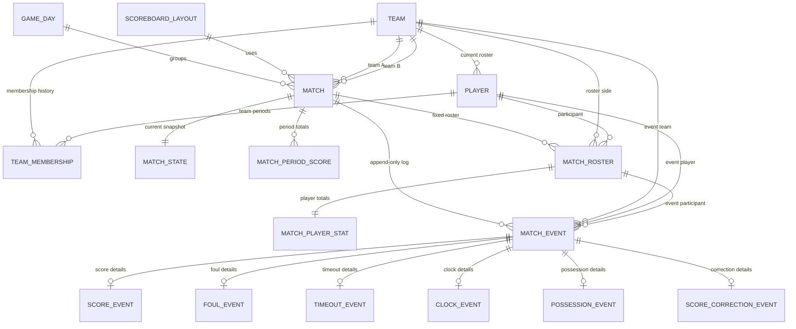

# Модель данных: электронное баскетбольное табло

Статус: проектирование этапа 1, объём MVP.

Основание из ТЗ:

- `docs/ТЗ_«Электронное_баскетбольное_табло».md`, разделы 4.3, 4.5, 4.8, 4.9, 6.6, 9.2, 11.
- Локальная реляционная СУБД с ACID-гарантиями и WAL или аналогом.
- Сохранение состояния матча не реже 1 раза в секунду.
- Критические события, включая очки, фолы, старт/стоп, сохраняются синхронно.
- Восстановление активного матча из СУБД менее чем за 5 секунд.
- Append-only журнал событий матча с системным timestamp и игровым временем.

ERD-файл: [diagrams/data-model-erd.mmd](diagrams/data-model-erd.mmd).

## Проектные решения

Для MVP используется гибридная модель:

1. Справочные данные нормализованы в обычных таблицах: команды, игроки, игровые дни, матчи, составы матчей и профили оформления табло.
2. Игровые факты записываются в `MATCH_EVENT` как append-only журнал.
3. `MATCH_STATE` хранит текущий оперативный снимок для быстрого обновления UI и восстановления после сбоя.
4. `MATCH_PERIOD_SCORE` и `MATCH_PLAYER_STAT` хранят кэшируемые агрегаты для счёта по периодам и статистики игроков.
5. Производные значения, включая счёт команды, очки игрока, персональные фолы, командные фолы, тайм-ауты и penalty state, обновляются транзакционно вместе с событием, которое их изменило.

Такой подход не даёт клиентам считать счёт и фолы самостоятельно. Сервер валидирует команду оператора, записывает событие и новое состояние в одной транзакции, затем транслирует зафиксированное состояние на LED-экран и операторские клиенты.

## Группы сущностей

### Команды и игроки

`TEAM` хранит карточку команды: название, город и необязательный логотип.

`PLAYER` хранит карточку игрока: ФИО, фото, текущую команду и текущий игровой номер. Поля текущей команды нужны для CRUD-экранов, поиска и фильтрации.

`TEAM_MEMBERSHIP` хранит историю привязки игрока к командам. Игрок может перейти в другую команду без изменения исторических матчей.

Рекомендуемые ограничения:

- `TEAM.name` обязателен.
- `PLAYER.last_name` и `PLAYER.first_name` обязательны.
- Текущий игровой номер должен быть уникален внутри текущей команды.
- `TEAM_MEMBERSHIP.active_to` пустой или больше/равен `active_from`.

### Игровой день и матчи

`GAME_DAY` группирует матчи по дате и площадке. Сущность поддерживает турнирный сценарий из ТЗ: несколько матчей в день, быстрое переключение к следующему матчу и предварительно созданное расписание.

`MATCH` хранит плановую и рабочую карточку матча:

- команда A и команда B;
- дата и время начала;
- часовой пояс;
- площадка;
- длительность четверти, по умолчанию 600 секунд;
- статус: `scheduled`, `warmup`, `in_progress`, `break`, `overtime`, `finished`, `cancelled`.

Рекомендуемые ограничения:

- `team_a_id` и `team_b_id` должны отличаться.
- `quarter_duration_seconds` должен быть больше нуля.
- Перед стартом матча должен существовать ровно один `MATCH_STATE`.

### Состав матча

`MATCH_ROSTER` фиксирует участников конкретного матча. Таблица хранит игрока, сторону команды, игровой номер и роль в рамках этого матча.

Эта таблица намеренно отделена от `PLAYER.current_team_id`: старые матчи не должны меняться после перехода игрока или изменения номера.

Рекомендуемые ограничения:

- `(match_id, team_id, player_id)` уникален.
- `(match_id, team_id, jersey_number)` уникален для активных игроков.
- `side` равен `A` или `B` и соответствует одной из команд в `MATCH`.

### Профиль табло

`SCOREBOARD_LAYOUT` хранит профили визуального оформления LED-табло. Поле `config` в JSON содержит цвета, шрифты, layout preset, включение/выключение блоков, правила отображения статистики, фон и сокращения названий команд.

Рекомендуемые ограничения:

- В системе должен существовать один дефолтный профиль.
- Некорректный пользовательский профиль не должен блокировать fallback на дефолтный профиль.

### Состояние матча

`MATCH_STATE` - текущий оперативный снимок матча. Он обновляется:

- синхронно для критических событий: очки, фолы, тайм-ауты, старт/стоп, коррекции;
- не реже 1 раза в секунду, пока запущены таймеры.

Снимок хранит:

- текущий период и тип периода;
- значения game clock и shot clock в миллисекундах;
- признаки запущенных таймеров;
- счёт команд;
- командные фолы текущего периода;
- счётчики тайм-аутов по половинам и овертайму;
- владение;
- текущий режим отображения.

`MATCH_STATE` оптимизирован для восстановления матча менее чем за 5 секунд. Это не аудит-история; за историю отвечает `MATCH_EVENT`.

### Агрегаты для отображения

`MATCH_PERIOD_SCORE` хранит счёт команды по периодам. Он нужен для экранов перерыва и отображения счёта по четвертям без проигрывания полного журнала событий.

`MATCH_PLAYER_STAT` хранит текущие очки, персональные фолы и признак удаления по фолам для игрока из состава конкретного матча. Он нужен для блока статистики игроков на LED-табло и в операторской панели.

Эти таблицы производные от событий и обновляются в той же транзакции, что `MATCH_EVENT` и `MATCH_STATE`. Они не являются независимым источником истины. При рассинхронизации их можно пересобрать из append-only журнала.

### Журнал событий матча

`MATCH_EVENT` - append-only журнал. Каждое событие хранит:

- матч;
- необязательную команду, игрока и участника состава матча;
- тип события;
- период;
- game clock и shot clock в момент события;
- источник: панель управления, пульт времени, пульт счёта или система;
- роль оператора;
- timestamp.

Коррекции представляются новыми событиями. Существующие события не редактируются и не удаляются. Если нужен логический откат, новое событие коррекции или отмены ссылается на исходное событие через `reverted_event_id`.

Ожидаемые типы событий:

- `score`;
- `foul`;
- `timeout`;
- `clock`;
- `possession`;
- `score_correction`;
- `period_change`;
- `display_mode_change`;
- `match_status_change`;
- `system_note`.

### События очков

`SCORE_EVENT` хранит детали начисления очков и корректировок, связанных с выбранным игроком:

- `points_delta`: `1`, `2`, `3` или отрицательное значение для коррекции;
- `team_score_after`;
- `player_points_after`;
- тип начисления: штрафной, двухочковый, трёхочковый или коррекция.

Командный счёт на табло обновляется из этих событий и событий ручной коррекции.

### События фолов

`FOUL_EVENT` хранит персональные и командные фолы:

- изменение количества фолов;
- тип фола;
- количество фолов игрока после события;
- количество командных фолов в текущем периоде после события;
- признак пятого персонального фола;
- признак team penalty после события.

Командные фолы сбрасываются при смене периода согласно баскетбольным правилам. В событии сохраняется период, поэтому исторические penalty state остаются проверяемыми.

### События тайм-аутов

`TIMEOUT_EVENT` хранит запросы тайм-аутов и результат валидации:

- командный или официальный тайм-аут;
- длительность;
- счётчики тайм-аутов команды после события;
- предупреждение о граничном случае лимита.

Точные правила лимитов FIBA относятся к доменной валидации. База хранит достаточно фактов, чтобы проверить принятое решение.

### Часы, владение и коррекции

`CLOCK_EVENT` фиксирует действия с game clock, shot clock, таймером тайм-аута, таймером перерыва, разминкой и ручными корректировками времени.

`POSSESSION_EVENT` фиксирует ручную смену стрелки владения.

`SCORE_CORRECTION_EVENT` фиксирует прямую коррекцию командного счёта, когда оператору нужно исправить отображаемый счёт без привязки к конкретному игроку.

## Границы транзакций

Каждая операторская команда, меняющая состояние матча, выполняется в одной транзакции:

1. Проверить команду по статусу матча, периоду, ограничениям FIBA и выбранному игроку/команде.
2. Вставить одну запись `MATCH_EVENT`.
3. Вставить детальную запись события, если она нужна.
4. Обновить `MATCH_STATE`.
5. Обновить агрегаты отображения, например `MATCH_PERIOD_SCORE` и `MATCH_PLAYER_STAT`.
6. Зафиксировать транзакцию.
7. Разослать зафиксированное состояние клиентам.

UI не должен самостоятельно рассчитывать счёт или фолы независимо от ответа сервера.

## Модель восстановления

При старте или перезапуске приложения:

1. Найти активный матч по статусу.
2. Загрузить его `MATCH_STATE`.
3. Загрузить последние строки `MATCH_EVENT` для журнала оператора.
4. Возобновить таймеры по серверным правилам monotonic timing.
5. Разослать восстановленное состояние на LED-экран и операторские клиенты.

Если снимок отсутствует или повреждён, сервер может восстановить оперативное состояние из `MATCH_EVENT`, но это резервный сценарий, а не штатный путь запуска.

## Вне рамок этапа 1

В модель намеренно не включены:

- импорт и экспорт внешних федераций;
- таблицы PDF-протокола матча;
- интеграция с OBS overlay;
- таблицы аппаратного протокола shot clock;
- полноценная конфигурация правил 3x3.

Текущая схема оставляет место для этих возможностей через типы событий, `config` профилей табло и будущие таблицы правил матча.
