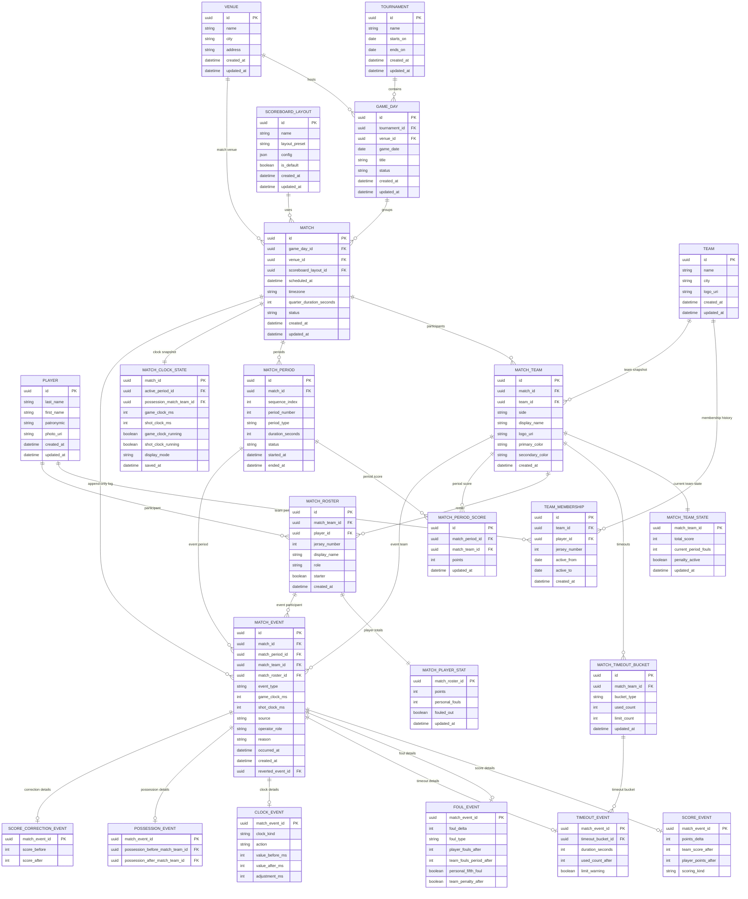

# Модель данных: электронное баскетбольное табло

Основание из ТЗ:

- `docs/ТЗ_«Электронное_баскетбольное_табло».md`, разделы 4.3, 4.5, 4.8, 4.9, 6.6, 9.2, 11.
- Локальная реляционная СУБД с ACID-гарантиями и WAL или аналогом.
- Сохранение состояния матча не реже 1 раза в секунду.
- Критические события, включая очки, фолы, старт/стоп, сохраняются синхронно.
- Восстановление активного матча из СУБД менее чем за 5 секунд.
- Append-only журнал событий матча с системным `timestamp` и игровым временем.

Полная ERD-диаграмма хранится в этом документе, чтобы модель данных имела один источник правды.

## Проектные решения

Модель приведена к 3НФ для основных операционных данных. Основные изменения относительно первичного MVP-наброска:

1. У игрока нет `current_team_id` и `jersey_number` как источников истины. Принадлежность к команде и номер хранятся в `TEAM_MEMBERSHIP`, а состав конкретного матча фиксируется в `MATCH_ROSTER`.
2. В `MATCH` нет колонок `team_a_id` и `team_b_id`. Команды матча вынесены в `MATCH_TEAM`, где хранится сторона `A/B` и снимок отображаемого имени, логотипа и цветов на момент матча.
3. Текущий снимок матча разделён на `MATCH_CLOCK_STATE`, `MATCH_TEAM_STATE`, `MATCH_TIMEOUT_BUCKET` и `MATCH_PLAYER_STAT`. Это убирает повторяющиеся группы вида `team_a_*` / `team_b_*`.
4. Периоды вынесены в `MATCH_PERIOD`, поэтому события, счёт по периодам и активные часы ссылаются на одну сущность периода.
5. Игровые факты записываются в `MATCH_EVENT` как append-only журнал, а детальные таблицы событий хранят только данные своего типа события.

`SCOREBOARD_LAYOUT.config` остаётся JSON-документом намеренно. Профиль оформления является конфигурацией интерфейса, а не высокочастотными операционными данными матча; строгая нормализация цветов и layout-настроек усложнит MVP без практической пользы.

## Справочники

`VENUE` хранит площадки. `GAME_DAY` хранит площадку по умолчанию для расписания дня, а `MATCH.venue_id` хранит фактическую площадку матча. Это позволяет перенести один матч на другую площадку без создания нового игрового дня и без дублирования строкового `venue`.

`TOURNAMENT` является опциональной надстройкой над игровыми днями. Для одиночной инсталляции можно создавать игровой день без турнира.

`TEAM` хранит карточку команды: название, город и логотип.

`PLAYER` хранит только личные данные игрока: ФИО и фото. Команда и номер не лежат в `PLAYER`, потому что они меняются во времени.

`TEAM_MEMBERSHIP` хранит историю привязки игрока к команде:

- команда;
- игрок;
- игровой номер;
- дата начала;
- дата окончания.

Рекомендуемые ограничения:

- `TEAM.name` обязателен.
- `PLAYER.last_name` и `PLAYER.first_name` обязательны.
- Для активных записей `TEAM_MEMBERSHIP` номер уникален внутри команды.
- `active_to` пустой или больше/равен `active_from`.

## Матч и участники

`MATCH` хранит только свойства самого матча:

- игровой день;
- площадку;
- профиль табло;
- плановое время начала;
- часовой пояс;
- длительность четверти;
- статус.

Команды матча лежат в `MATCH_TEAM`. Для обычного баскетбола у матча две строки `MATCH_TEAM`: сторона `A` и сторона `B`. Такой вариант не блокирует будущие сценарии, где нужны снимки названия/логотипа/цветов команды на момент матча или отдельные настройки отображения стороны.

`MATCH_ROSTER` фиксирует состав конкретной стороны матча. Он ссылается на `MATCH_TEAM` и `PLAYER`, хранит игровой номер и отображаемое имя на этот матч. Исторический матч не меняется после перехода игрока в другую команду.

Рекомендуемые ограничения:

- `(match_id, side)` уникален в `MATCH_TEAM`.
- `(match_team_id, player_id)` уникален в `MATCH_ROSTER`.
- `(match_team_id, jersey_number)` уникален для активных игроков состава.
- Перед стартом матча должны существовать две команды матча, периоды, состояние часов и состояния команд.

## Периоды

`MATCH_PERIOD` хранит четверти, овертаймы и при необходимости служебные периоды:

- порядковый индекс;
- номер периода;
- тип: `quarter`, `overtime`, `warmup`, `break`;
- длительность;
- статус;
- фактические времена начала и окончания.

События и счёт по периодам ссылаются на `MATCH_PERIOD`, а не хранят разрозненные `period_number` и `period_type`.

## Оперативное состояние

`MATCH_CLOCK_STATE` хранит один текущий снимок часов матча:

- активный период;
- game clock;
- shot clock;
- признаки запущенных таймеров;
- текущую сторону владения;
- режим отображения;
- время сохранения снимка.

`MATCH_TEAM_STATE` хранит текущий счёт и командные фолы для одной стороны матча. Для матча с двумя командами будет две строки.

`MATCH_TIMEOUT_BUCKET` хранит использованные тайм-ауты по команде и сегменту лимита: `first_half`, `second_half`, `overtime`. Это заменяет повторяющиеся поля `team_a_timeouts_first_half`, `team_b_timeouts_first_half` и аналогичные.

`MATCH_PLAYER_STAT` хранит производные очки и персональные фолы игрока в конкретном матче.

Все эти таблицы обновляются синхронно с критическими событиями и не реже одного раза в секунду при запущенных таймерах.

## Агрегаты для отображения

`MATCH_PERIOD_SCORE` хранит счёт стороны матча за конкретный период. Он нужен для экранов перерыва и отображения счёта по четвертям без проигрывания полного журнала событий.

`MATCH_TEAM_STATE`, `MATCH_PLAYER_STAT` и `MATCH_PERIOD_SCORE` являются производными от `MATCH_EVENT`. Они нужны для быстрого UI и восстановления. При рассинхронизации их можно пересобрать из append-only журнала.

## Журнал событий

`MATCH_EVENT` - append-only журнал. Каждое событие хранит:

- матч;
- период;
- сторону матча;
- участника состава, если событие связано с игроком;
- тип события;
- game clock и shot clock в момент события;
- источник: панель управления, пульт времени, пульт счёта или система;
- роль оператора;
- timestamp.

Коррекции представляются новыми событиями. Существующие события не редактируются и не удаляются. Если нужен логический откат, новое событие коррекции или отмены ссылается на исходное событие через `reverted_event_id`.

Ожидаемые типы событий:

- `score`;
- `foul`;
- `timeout`;
- `clock`;
- `possession`;
- `score_correction`;
- `period_change`;
- `display_mode_change`;
- `match_status_change`;
- `system_note`.

Детальные таблицы событий:

- `SCORE_EVENT`: очки игрока и счёт после события.
- `FOUL_EVENT`: персональные и командные фолы после события.
- `TIMEOUT_EVENT`: использованный timeout bucket и результат валидации лимита.
- `CLOCK_EVENT`: запуск, стоп, сброс и коррекция таймеров.
- `POSSESSION_EVENT`: смена владения.
- `SCORE_CORRECTION_EVENT`: ручная коррекция счёта одной стороны.

## Границы транзакций

Каждая операторская команда, меняющая состояние матча, выполняется в одной транзакции:

1. Проверить команду по статусу матча, периоду, ограничениям FIBA и выбранному игроку/команде.
2. Вставить одну запись `MATCH_EVENT`.
3. Вставить детальную запись события, если она нужна.
4. Обновить `MATCH_CLOCK_STATE`, `MATCH_TEAM_STATE`, `MATCH_TIMEOUT_BUCKET`, `MATCH_PLAYER_STAT` или `MATCH_PERIOD_SCORE` по типу события.
5. Зафиксировать транзакцию.
6. Разослать зафиксированное состояние клиентам.

UI не должен самостоятельно рассчитывать счёт или фолы независимо от ответа сервера.

## Модель восстановления

При старте или перезапуске приложения:

1. Найти активный матч по статусу.
2. Загрузить `MATCH_CLOCK_STATE`.
3. Загрузить строки `MATCH_TEAM_STATE`, `MATCH_TIMEOUT_BUCKET`, `MATCH_PLAYER_STAT` и `MATCH_PERIOD_SCORE`.
4. Загрузить последние строки `MATCH_EVENT` для журнала оператора.
5. Возобновить таймеры по серверным правилам monotonic timing.
6. Разослать восстановленное состояние на LED-экран и операторские клиенты.

Если снимки состояния отсутствуют или повреждены, сервер может восстановить оперативное состояние из `MATCH_EVENT`, но это резервный сценарий, а не штатный путь запуска.

## Вне рамок этапа 1

В модель намеренно не включены:

- импорт и экспорт внешних федераций;
- таблицы PDF-протокола матча;
- интеграция с OBS overlay;
- таблицы аппаратного протокола shot clock;
- полноценная конфигурация правил 3x3.

Текущая схема оставляет место для этих возможностей через `MATCH_TEAM`, `MATCH_PERIOD`, типы событий, `config` профилей табло и будущие таблицы правил матча.
